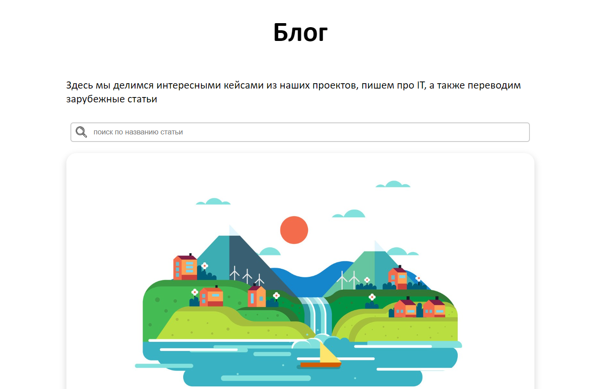
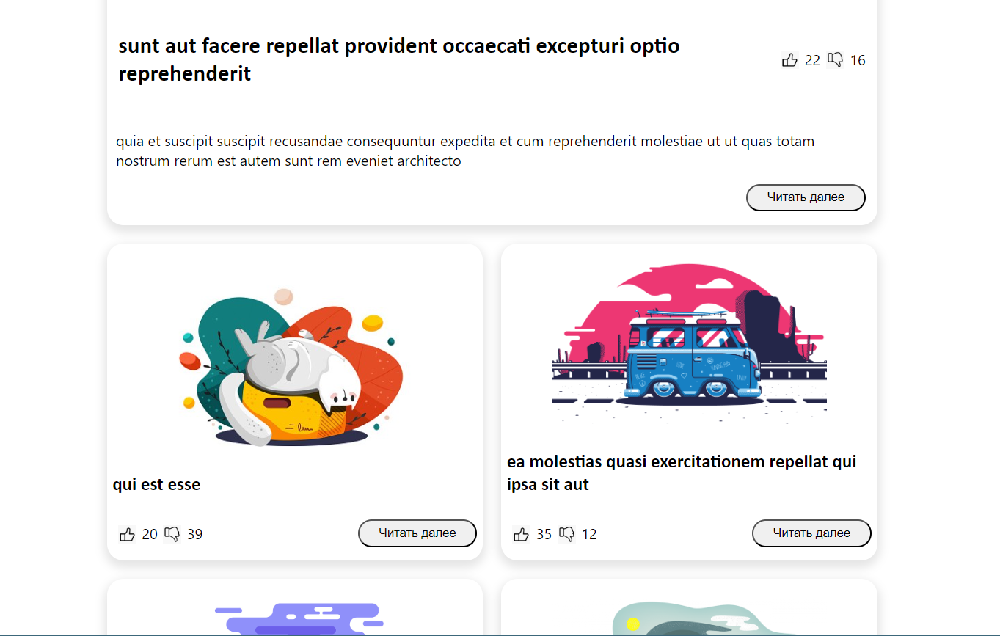
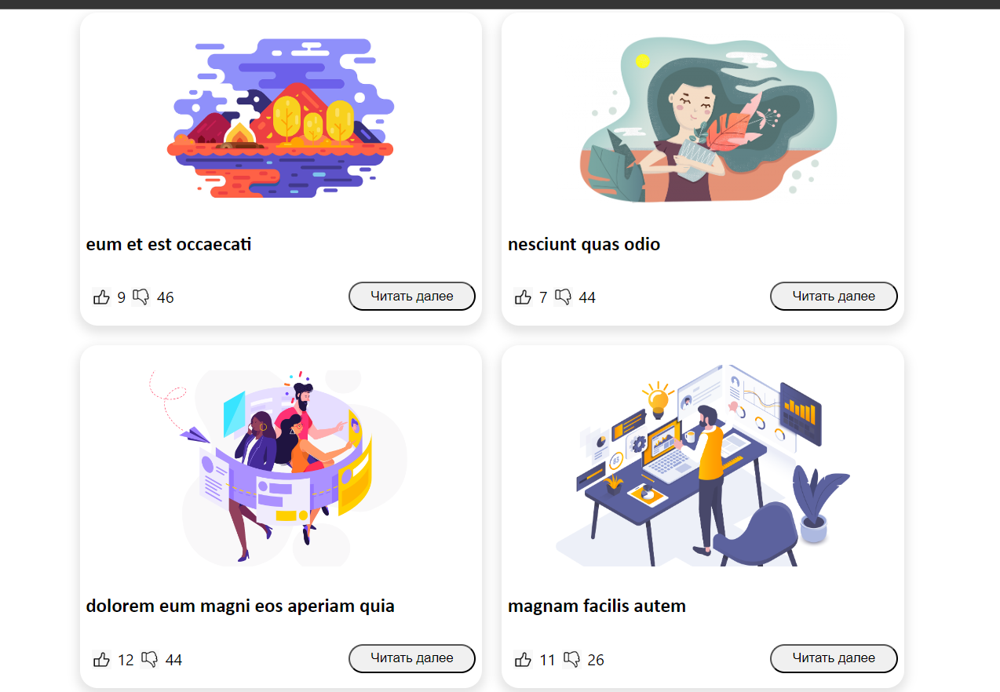

# Инструкция по установке и запуску проекта

Эта инструкция поможет вам скачать и запустить Blog
на вашем локальном компьютере для разработки и тестирования.
Предполагается, что у вас уже установлены node v18.18.2
и npm v9.8.1 .

## Шаг 1: Клонирование проекта

Для начала необходимо клонировать репозиторий 
проекта на ваш локальный компьютер. Откройте терминал и выполните следующую команду:

### `git clone https://github.com/NiceBoyClick/Blog.git`

## Шаг 2: Установка зависимостей

Перейдите в директорию проекта с помощью команды cd:

### `cd Blog`
Затем установите все необходимые зависимости, выполнив следующую команду в терминале:

### `npm install`

или, если вы используете yarn, выполните:

### `yarn install`

## Шаг 3: Запуск проекта

После установки всех зависимостей вы можете запустить проект на локальном сервере. Для этого выполните:
### `npm start`

или, если используете yarn:

### `yarn start`

Проект будет запущен и доступен в браузере по адресу http://localhost:3000 (или другому порту, если он был автоматически изменен).
вот так должен выглядеть сайт в браузере:

